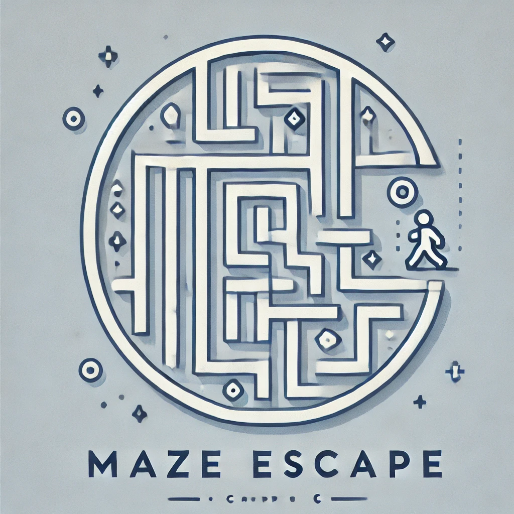
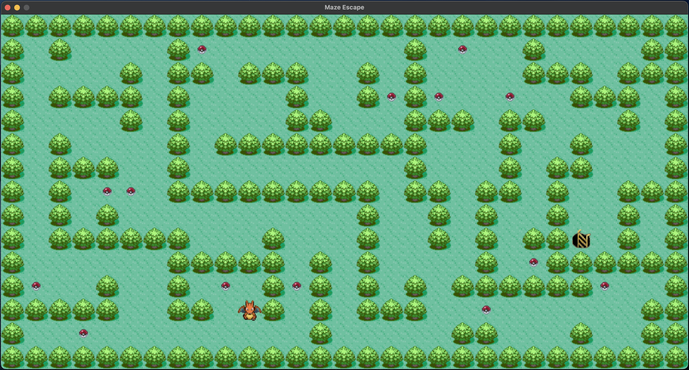

<div align="center">
  
</div>
<br>
<div align="center">
  
  <br>
  
  
  
  
</div>

---

# 🧩 Maze Escape

This project is a simple **2D puzzle game** built for educational purposes using the **C language** and the **MiniLibX Graphics Library**. Designed to run on **Linux** and **macOS**, this open-source project showcases the basics of **game development** with **C**.

*	**2D game** using **XPM** images as assets.
*	Includes 6 different asset packs and 4 challenging levels.
*	A perfect introduction to game development with C language.
*	Lightweight and easy to customize for learning.

Explore how C can bring games to life with this opensource puzzle game!

---

## Preview

<div align="center">
  
</div>

---

## 🛠️ Installation

To install this project, Launch the Terminal app on your system, and run the commands below. <br>
  - If a pop-up appears prompting you to download the Xcode Command Line Tools after the first command, click “Download” and then run the first command again.

###  macOS

1. **Clone repo**
```bash
git clone https://github.com/marsdevx/maze-escape.git ~/Downloads/Maze-Escape
```

2. **Compile project**
```bash
cd ~/Downloads/Maze-Escape && make macos
```

### 🐧 Linux

1. **Clone repo**
```bash
git clone https://github.com/marsdevx/maze-escape.git ~/Downloads/Maze-Escape
```

2. **Compile project**
```bash
cd ~/Downloads/Maze-Escape && make linux
```

---

## 🚀 Usage

1. **Navigate to the Game Directory**
```bash
cd ~/Downloads/Maze-Escape
```

2. **Run the Game**
```bash
./maze_escape levels/lvl1 textures/pacman
```

3. **Customize Your Game**

You can modify the level and texture by changing the corresponding arguments in the command:

- Levels: Replace `levels/lvl1` with one of the following:
  - `levels/lvl1`
  - `levels/lvl2`
  - `levels/lvl3`
  - `levels/lvl4`
- Textures: Replace `textures/pacman` with one of the following:
  - `textures/pacman`
  - `textures/adventurer`
  - `textures/chicken`
  - `textures/pokemon`
  - `textures/space-ship`
  - `textures/time-adventure`

---

## ⚙️ Advanced Options

### Add Your Own Map

You can add custom maps to the game, as long as they follow these rules:

1. The map must be a `.ber` file.
2. The map can only contain the following characters:

| CHAR | OBJECT        |
|------|---------------|
| 1    | Wall          |
| C    | Collectible   |
| E    | Exit          |
| P    | Player        |
| 0    | Background    |

#### Example of a valid map

```
11111111111
10000P1C001
11111011101
10001000001
101011111E1
11111111111
```

### Add Your Own Textures

You can add custom textures to the game, as long as they follow these rules:

1. The `textures` folder must contain **exactly 5 files**.
2. All files must be in the `.xpm` format.
3. The files must be named as follows:
   - `bg.xpm` (background)
   - `exit.xpm` (exit point)
   - `item.xpm` (collectible items)
   - `player.xpm` (player character)
   - `wall.xpm` (walls)